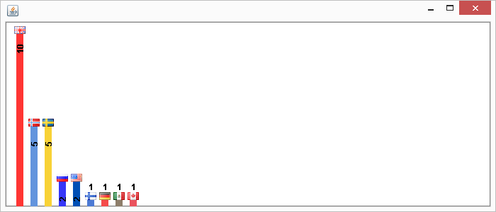
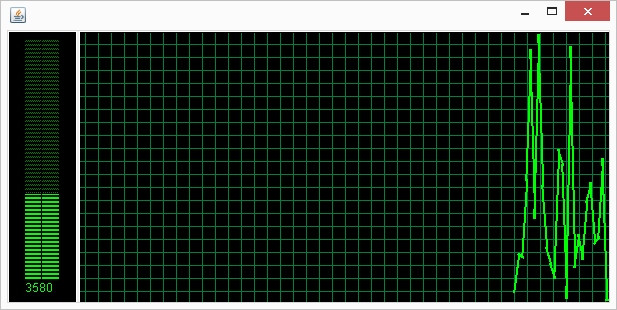
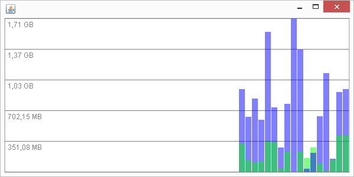

# graphslib

Small library that currently includes

- **Country statistic graph** - Orders a list of countries with a number in order and draws them with flags

- **Windows 7 and below task manager remake** - Good for example a performance monitor

- **Windows 7 and below task manager remake** - Specialized in showing network usage

## Examples

You can find examples in the Debug classes in the corresponding package